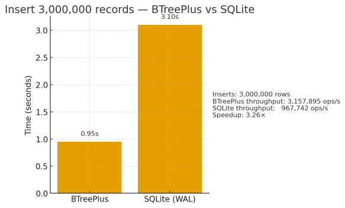

# BTreePlus

A lightweight, high‑performance **B+‑Tree** implementation for .NET. Designed for **embedded indexing**, **fast lookups**, and **deterministic on‑disk persistence**.

Supports both **in‑memory** and **file‑backed** modes. Inserts, finds, commits, and closes with predictable performance and zero external dependencies.

**Performance Highlight**

**3,000,000 inserts in 0.95s**  
vs **SQLite (WAL): 3.10s**  
➡️ **~3.26× faster**




---

## Features (Community Edition)

* ✅ B+‑Tree with sorted key navigation
* ✅ Fixed‑length keys and values for maximum speed
* ✅ In‑Memory or File‑Backed operation
* ✅ `Insert`, `Find`, `Commit`, `Close`
* ✅ Transparent page caching
* ✅ Zero dependencies — pure C#

> The Community Edition is ideal for embedded indexing, research, education, and small database engines.

For advanced database/production workloads (iterators, compression, journaling, concurrency, range scanning) see **Commercial Edition** section.

---

## Example Usage

````csharp
using System.Buffers.Binary;
using mmh; // namespace containing BTree

// Open or create a file-backed tree (example values)
var bt = BTree.CreateOrOpen(
    path: "data.bt",
    keyBytes: 8,
    dataBytes: 4,
    pageSize: 8,          // 8 * 512 = 4096 bytes
    enableCache: true);

// INSERT key=Int64(BE) → value=Int32(LE)
Span<byte> key = stackalloc byte[8];
Span<byte> val = stackalloc byte[4];
BinaryPrimitives.WriteInt64BigEndian(key, 12345);
BinaryPrimitives.WriteInt32LittleEndian(val, 42);
_ = bt.Insert(key, val);

// FIND
byte[] outBuf = new byte[4];
bool ok = bt.Find(key, outBuf, bLock: true);
int found = ok ? BinaryPrimitives.ReadInt32LittleEndian(outBuf) : -1;

// COMMIT
bt.Commit();
```csharp
using BTreePlus;

// Create or open an index (file‑backed)
using var tree = new BTree(
    path: "data.idx",
    keyLength: 8,
    valueLength: 16,
    pageSize: 4096
);

// Insert a key/value pair
var key = BitConverter.GetBytes(12345L);
var value = new byte[16];
value[0] = 42;
tree.Insert(key, value);

// Search
if (tree.Find(key, out var result))
{
    Console.WriteLine("Found value: " + result[0]);
}

// Ensure data is flushed to disk
tree.Commit();
````

---

## API Overview

| Method                                                     | Description                                     |
| ---------------------------------------------------------- | ----------------------------------------------- |
| `Insert(ReadOnlySpan<byte> key, ReadOnlySpan<byte> value)` | Insert or overwrite a key/value record          |
| `bool Find(ReadOnlySpan<byte> key, Span<byte> value)`      | Point lookup; copies value into provided buffer |
| `void Commit()`                                            | Flushes all dirty pages to disk                 |
| `void Close()`                                             | Closes the index and releases resources         |

## Disk Format (Simplified)

* Pages are fixed‑size (default 4096 bytes)
* Keys and values are fixed‑length
* Node splits propagate upward
* Commit ensures persisted page writes

> Crash recovery guarantees depend on environment. For full transactional durability, see **Commercial Edition**.

---

## Performance Notes

* **Benchmark (FileStream, cache enabled):** ~3,000,000 inserts in **0.95 seconds** on a modern NVMe system (~3.1M inserts/sec).

* Designed for **very fast point lookups**

* Avoids GC churn by reusing buffers and pages

* Performance scales with page size and key ordering

A benchmark suite (BenchmarkDotNet) is included in `/bench/` (optional).

---

## Commercial Edition

The Commercial Edition adds:

* Variable‑length keys & values
* Concurrent read/write (multi‑writer safety)
* MVCC or journaling for crash‑safe commits
* Cursors & forward/backward iteration
* Prefix/range scans (e.g., `Seek(prefix) → Next() → Next() ...`)
* Bulk load and compaction
* Optional page compression

If you are building:

* A **full database**,
* A **document store**,
* A **ledger**,
* A **POS / ERP engine**,
* A **custom distributed store**,

…then the Commercial Edition is likely a better fit.

Contact: **[btplus@mmhsys.com](mailto:btplus@mmhsys.com)** (placeholder) to discuss.

---

## License

Community Edition is licensed under **MIT**.
Commercial features require a license.

---

## Roadmap

* Tests + property‑based correctness suite
* Iterators in Community Edition (optional)
* Metadata pages / schema metadata

---

## Status

Active development. API subject to minor refinement before **v1.0.0**.

Pull requests & discussions welcome.

```text
BTreePlus — Fire for Builders
```

---

## Minimal API (surface)

```csharp
bool Insert(ReadOnlySpan<byte> key, ReadOnlySpan<byte> value, bool bLock = true);
bool Find(ReadOnlySpan<byte> key, Span<byte> value, bool bLock = false);
void Bof();
bool Next(out ReadOnlySpan<byte> key, Span<byte> value, bool acquireLock = true);
```
